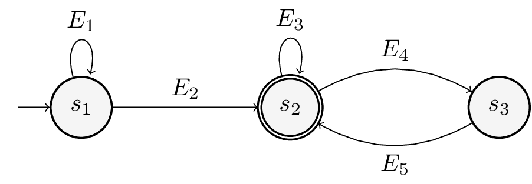
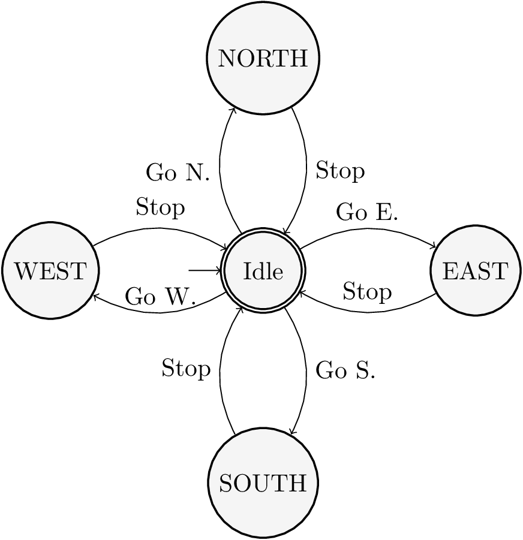

# Closed-loop odometry-based robot motion control

## Objectives

1.- Understand the concept Finite-State Machine (FSM) and implement a simple one.

2.- Implement a closed-loop robot controller.

3.- Implement a realistic robot motion controller

## Prerequisites

Install the following ROS packages:

* stdr_simulator
* stdr_resources
* stdr_gui
* stdr_robot

Download the [launch file](simple_room.launch), which contains the scenario for this assignment. Verify that you can correctly run the launch file with roslaunch.

## Finite-State Machines

A Finite-State Machine (os simply FSM) is an abstract machine that models its behaviour in a set of finite states. Here "state" stands for the intuitive concept that we have of state. For instance, a person may be in state "running", or "jumping" or "walking" or "idle". One important aspect about a FSM is that the transicion among its states is controlled, usually, by a set of events, so if the FSM is in a certain state, it only can transate to a limited set of states. In this way the FSM is an excellent tool to model behaviours. This feature along with the extreme ease of its implementation makes FSM a tool of choice in a great number of applications (from Robotics to Videogames, just to mention two).

A very convenient way to represent FSM is throgh a directed graph in which the states are represented by circles and the transitions among states with directed edges. The initial state is usually represented with a double circle and there is also a final state.

Where s_i means state i and E_j means event j.

The implementation of a FSM is straightforward. A naïve implementation can use a variable to store the current state and a if-elseif or switch-case statement to assess the state and implement the logic associated with it. 

~~~Python
state = "RUNNING"

if state == "WALKING":
	# Do something
	state = "WALKING";
elif state == "RUNNING";
	# Do something
	state = "IDLE";
~~~

Much more complex can be used in case the number of states were high, or FSMs that can change in time. For us the simple implementation previously shown makes our job.

Finite-State Machines are widely studied in a Mathematics and Computer Science field named Automata Theory, and has a deep impact in Computation. 

## Practical assignment

The goal to achieve in this assignment is the same one that the previous assignment, "Basic robot motion control with Rospy". Given the robot placed in the map shown below, move it from its initial location on point A to the point B. In this case we will use a more elaborated mechanism to control the robot motion based on a FSM and odometry.

To this end, perform the following tasks:

1.- Create a new ROS package named fsm_controller.

2.- Create a subfolder launch.

3.- Move the simple_room.launch file to the launch folder.

4.- Implement a Python node named `fsm_controller` which moves the robot from A to B. To this end implement the FSM shown in the figure.

